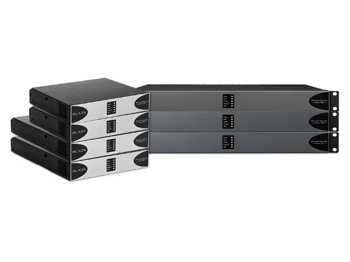

<div align="center">

# 🔊 Blaze PowerZone Connect — Home Assistant Integration

[](https://hacs.xyz)
[](https://www.home-assistant.io)
[](LICENSE)
[](https://github.com/Micpi/blaze-powerzone/releases/latest)
[](https://buymeacoffee.com/mickaelpila)

**Intégration complète Home Assistant pour les amplificateurs Blaze PowerZone Connect.**  
Contrôlez vos amplificateurs de sonorisation professionnels directement depuis votre tableau de bord HA,
avec découverte automatique réseau, polling temps réel et accès à tous les paramètres DSP.



</div>

---

## 📖 Sommaire

- [Fonctionnalités](#-fonctionnalités)
- [Prérequis](#-prérequis)
- [Installation via HACS](#-installation-via-hacs)
- [Configuration](#-configuration)
- [Entités créées](#-entités-créées)
- [Service avancé](#-service-avancé)
- [Structure du projet](#-structure-du-projet)
- [Protocole réseau](#-protocole-réseau)
- [FAQ](#-faq)
- [Changelog](#-changelog)

---

## ✨ Fonctionnalités

| Fonctionnalité | Détail |
|---|---|
| 🔍 **Découverte automatique** | Détection via mDNS/Zeroconf (`_pasconnect._tcp.local.`) — l'amplificateur est détecté dès qu'il apparaît sur le réseau |
| 🎛️ **Config Flow complet** | Interface de configuration guidée avec Options Flow pour modifier les paramètres sans réinstaller |
| 📡 **Communication TCP** | Client TCP asynchrone (asyncio) sur le port 7621 — latence minimale, aucune dépendance HTTP |
| 🔄 **Reconnexion automatique** | Backoff exponentiel 1s → 2s → 4s → ... → 60s en cas de coupure réseau |
| 📊 **Polling temps réel** | Mise à jour de tous les registres toutes les 30 secondes via `DataUpdateCoordinator` |
| 🧩 **5 types de plateformes** | Sensor, Switch, Number (slider), Select, Button — couverture complète de l'API |
| 🛠️ **Service avancé** | `blaze_powerzone.send_raw_command` pour envoyer n'importe quelle commande registre brute |
| 🌐 **Multi-instances** | Plusieurs amplificateurs gérés simultanément, chacun comme un device HA indépendant |
| 🏷️ **Traductions** | Interface disponible en **français** et **anglais** |

---

## 🔧 Prérequis

- **Home Assistant** 2024.1 ou supérieur
- **Python** 3.12+ (inclus dans HA)
- Dépendance Python : `websockets >= 12.0` (installée automatiquement)
- L'amplificateur Blaze PowerZone Connect doit être accessible sur le **réseau local**
- Port **7621** TCP ouvert entre HA et l'amplificateur

---

## 📦 Installation via HACS

### Méthode recommandée — HACS

1. Ouvrez **HACS** dans Home Assistant
2. Allez dans **Intégrations** → cliquez sur le menu ⋮ → **Dépôts personnalisés**
3. Ajoutez l'URL : `https://github.com/Micpi/blaze-powerzone`
4. Choisissez la catégorie **Integration**
5. Recherchez **"Blaze PowerZone Connect"** et cliquez sur **Installer**
6. **Redémarrez** Home Assistant

### Méthode manuelle

1. Téléchargez la [dernière release](https://github.com/Micpi/blaze-powerzone/releases/latest)
2. Copiez le dossier `custom_components/blaze_powerzone/` dans votre répertoire `config/custom_components/`
3. **Redémarrez** Home Assistant

---

## ⚙️ Configuration

### Ajout de l'intégration

1. Allez dans **Paramètres** → **Appareils & Services**
2. Cliquez sur **+ Ajouter une intégration**
3. Recherchez **"Blaze PowerZone Connect"**
4. Choisissez la méthode de configuration :
   - **Automatique** : si votre amplificateur est découvert via mDNS, une notification apparaît directement
   - **Manuelle** : renseignez l'adresse IP, le port et le nom de l'appareil

### Paramètres de configuration

| Paramètre | Type | Défaut | Description |
|---|---|---|---|
| `host` | `string` | — | Adresse IP ou hostname de l'amplificateur |
| `port` | `integer` | `7621` | Port TCP de l'API Blaze |
| `name` | `string` | `Blaze PowerZone Connect` | Nom affiché dans HA |

### 🧭 Options Flow

Après installation, vous pouvez modifier les paramètres via **Paramètres** → **Appareils & Services** → **Blaze PowerZone Connect** → **Configurer**.

---

## 🗂️ Entités créées

### 🔵 Sensors — État du système

| Entité | Registre | Description |
|---|---|---|
| `sensor.system_state` | `SYSTEM.STATUS.STATE` | État global : `INIT`, `STANDBY`, `ON`, `FAULT` |
| `sensor.signal_in` | `SYSTEM.STATUS.SIGNAL_IN` | État entrée signal : `OFF`, `NO_SIGNAL`, `SIGNAL`, `CLIP` |
| `sensor.signal_out` | `SYSTEM.STATUS.SIGNAL_OUT` | État sortie signal : `OFF`, `NO_SIGNAL`, `SIGNAL`, `CLIP`, `FAULT` |
| `sensor.lan_ip` | `SYSTEM.STATUS.LAN` | Adresse IP LAN courante |
| `sensor.wifi_ip` | `SYSTEM.STATUS.WIFI` | Adresse IP WiFi courante |
| `sensor.firmware` | `SYSTEM.DEVICE.FIRMWARE` | Version du firmware embarqué |
| `sensor.firmware_date` | `SYSTEM.DEVICE.FIRMWARE_DATE` | Date du firmware |
| `sensor.api_version` | `API_VERSION` | Version de l'API Blaze |
| `sensor.in_X_signal` | `IN-X.STATUS.SIGNAL` | État signal par canal d'entrée |
| `sensor.in_X_clipping` | `IN-X.STATUS.CLIPPING` | Détection de clipping par entrée |

### 🟡 Numbers — Gains et niveaux (sliders)

| Entité | Plage | Pas | Description |
|---|---|---|---|
| `number.in_X_gain` | `-15 dB` → `+15 dB` | `0.5 dB` | Gain d'entrée (canaux analogiques) |
| `number.in_400_gain` | `-48 dB` → `0 dB` | `0.5 dB` | Niveau du générateur de bruit |
| `number.out_X_gain` | `-80 dB` → `+24 dB` | `0.5 dB` | Gain de sortie par canal |
| `number.out_X_limit` | `-80 dB` → `+24 dB` | `0.5 dB` | Limiter de sortie par canal |

### 🟢 Switches — Activations

| Entité | Registre | Description |
|---|---|---|
| `switch.in_X_stereo` | `IN-X.STEREO` | Mode stéréo (canaux 1 & 3 / paires analogiques) |
| `switch.in_X_mute` | `IN-X.MUTE` | Mute par canal d'entrée |
| `switch.in_X_eq_enabled` | `IN-X.EQ.BYPASS` | Activation/bypass de l'EQ d'entrée |
| `switch.out_X_mute` | `OUT-X.MUTE` | Mute par canal de sortie |
| `switch.out_X_eq_enabled` | `OUT-X.EQ.BYPASS` | Activation/bypass de l'EQ de sortie |

### 🔴 Selects — Modes et sélections

| Entité | Options | Description |
|---|---|---|
| `select.in_X_sensitivity` | `14DBU`, `4DBU`, `-10DBV`, `MIC` | Sensibilité d'entrée analogique |
| `select.out_X_mode` | `OFF`, `8R`, `70V`, `100V`, `BTL` | Mode de sortie (impédance/tension) |
| `select.out_X_source` | Tous les canaux d'entrée + Mix | Source audio assignée à la sortie |
| `select.generator_type` | `PINK`, `SINE` | Type de générateur de bruit de test |

### 🔵 Buttons — Actions

| Entité | Action |
|---|---|
| `button.power_on` | Envoi de la commande de mise sous tension |
| `button.power_off` | Envoi de la commande de mise en veille |

---

## 🛠️ Service avancé

Le service `blaze_powerzone.send_raw_command` permet d'envoyer directement une commande de registre brute à l'amplificateur. Utile pour accéder à des paramètres non exposés via les entités standard.

### Appel YAML

```yaml
service: blaze_powerzone.send_raw_command
data:
  entry_id: "votre_entry_id"   # Visible dans les paramètres de l'intégration
  command: "OUT-1.GAIN=-6.0"   # Commande au format REGISTRE=VALEUR
```

### 🧪 Exemples de commandes

```yaml
# Muter la sortie 2
command: "OUT-2.MUTE=1"

# Changer la sensibilité de l'entrée 1 en MIC
command: "IN-100.SENSITIVITY=MIC"

# Définir le gain de la sortie 3 à -12 dB
command: "OUT-3.GAIN=-12.0"

# Activer le générateur de bruit rose
command: "IN-400.GENERATOR.TYPE=PINK"
```

---

## 📁 Structure du projet

```
custom_components/blaze_powerzone/
├── __init__.py          # Setup de l'intégration, forward aux plateformes
├── manifest.json        # Métadonnées (version, dépendances, zeroconf)
├── const.py             # Constantes globales (registres, options, DOMAIN)
├── api.py               # Client TCP asynchrone avec reconnexion backoff
├── coordinator.py       # DataUpdateCoordinator — polling et cache des données
├── config_flow.py       # Config Flow + Options Flow avec validation
├── sensor.py            # Entités sensor (état système, signal, firmware)
├── switch.py            # Entités switch (mute, stéréo, bypass EQ)
├── number.py            # Entités number — sliders gain/limit (dB)
├── select.py            # Entités select (mode sortie, source, sensibilité)
├── button.py            # Entités button (Power On / Power Off)
├── services.yaml        # Schéma du service send_raw_command
├── strings.json         # Clés de traduction (base)
└── translations/
    ├── fr.json          # Interface en français
    └── en.json          # Interface en anglais
```

---

## 🌐 Protocole réseau

L'amplificateur Blaze PowerZone Connect expose une **API TCP** sur le port `7621`.

### Format des commandes

```
# Lecture d'un registre
GET <REGISTRE>
→ réponse : <REGISTRE>=<VALEUR>

# Écriture d'un registre
SET <REGISTRE>=<VALEUR>
→ réponse : ACK ou ERR

# Lecture de tous les registres
GET ALL
```

### Découverte mDNS

L'amplificateur s'annonce sur le réseau local via le type de service **`_pasconnect._tcp.local.`** — HA peut donc le détecter automatiquement sans que vous ayez à connaître son IP.

### Reconnexion

En cas de coupure, le client applique un **backoff exponentiel** :

```
Tentative 1 → attente 1s
Tentative 2 → attente 2s
Tentative 3 → attente 4s
Tentative 4 → attente 8s
Tentative 5 → attente 16s
Tentative 6 → attente 32s
Au-delà      → erreur levée (HA affiche l'entité en erreur)
```

---

## ❓ FAQ

**Q : L'amplificateur n'est pas découvert automatiquement — que faire ?**  
R : Vérifiez que l'amplificateur et Home Assistant sont sur le **même sous-réseau** (mDNS ne passe pas les routeurs). En cas de VLAN séparé, ajoutez l'intégration manuellement en renseignant l'adresse IP.

**Q : Les entités sont en état "Indisponible"**  
R : Vérifiez que le port `7621` est accessible depuis la machine qui héberge HA (`telnet <IP_AMPLI> 7621`). Contrôlez aussi le pare-feu de l'amplificateur.

**Q : Combien d'entités sont créées ?**  
R : Le nombre dépend des canaux actifs détectés lors du polling initial. En configuration standard (8 entrées + 8 sorties), vous obtenez environ **80 à 120 entités**.

**Q : Puis-je utiliser cette intégration avec plusieurs amplificateurs ?**  
R : Oui. Ajoutez l'intégration plusieurs fois (une par amplificateur). Chaque instance crée un device HA distinct avec ses propres entités.

**Q : Les modifications faites depuis l'interface Blaze sont-elles reflétées dans HA ?**  
R : Oui, grâce au polling toutes les 30 secondes. Le délai de synchronisation est donc de 0 à 30s.

---

## 📋 Changelog

Voir [CHANGELOG.md](CHANGELOG.md) pour l'historique détaillé des versions.

---

## 📄 Licence

Ce projet est distribué sous licence **MIT**. Voir [LICENSE](LICENSE) pour les détails.

---

<div align="center">
Fait avec ❤️ pour la communauté Home Assistant
</div>